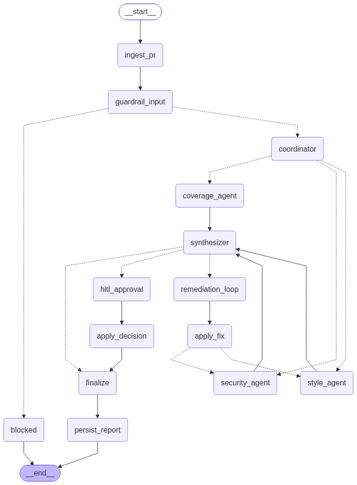

# CodeGuard CI

**An agentic code-review and secrets-scanning system for CI pipelines.**

*By Mohammed ALSHAIGI — capstone for Advanced Agentic AI Systems Engineering, SDAIA Academy.*

A pull request arrives at a webhook. A coordinator agent plans the review and delegates in
parallel to three role-specialised agents — security, style, and test coverage — each of which
calls **real** static analysis tools (`bandit`, `ruff`, `pytest --cov`, and an entropy-based
secret scanner) and then reasons over the raw output to add judgment the tool cannot provide.
A synthesizer resolves conflicts between them and issues a verdict: `APPROVE`,
`REQUEST_CHANGES`, or `BLOCK_MERGE`. Critical findings pause the graph at a human approval node.

The whole run is guarded, traced, cost-metered, checkpointed to SQLite, and served from FastAPI
inside Docker Compose.

```
$ curl -X POST localhost:8000/webhook/pr -d '{"fixture":"pr_injection"}'
  pr_id     : PR-1099   status: blocked   verdict: BLOCK_MERGE
  llm_calls : 0        <- the guardrail stopped it before any model was reached
```

---

## The problem

Pull-request review is a security bottleneck. Human reviewers miss hardcoded credentials, and a
leaked key in a merged commit is permanent — rotating it is the only remedy. Plain linters catch
syntax but have no judgment: they cannot tell a real AWS key from a test fixture, and they flag a
long line with the same urgency as a bare `except:` swallowing errors in a payment path.

CodeGuard CI puts a reasoning layer on top of real tools, so the **triage** is automated, not just
the scanning. Its adversarial surface is native to the domain: a pull request whose description
instructs the automated reviewer to approve it is a realistic attack, and blocking it is a
demonstrated guardrail rather than a contrived one.

---

## Architecture

**Coordination strategy: centralised coordinator with hierarchical delegation.** One planner sits
above three specialists, decides which are needed, and delegates. The specialists never talk to
each other — they write structured Pydantic `Finding` objects into shared graph state, and a
synthesizer adjudicates over those objects alone.



| Stage | What happens |
|---|---|
| `ingest_pr` | Loads the PR, **redacts secrets and PII before anything else sees them** |
| `guardrail_input` | Prompt-injection detection; a hit routes to `blocked` and never reaches a model |
| `coordinator` | Reads the diff, produces an ordered plan, decides which specialists to run |
| **fan-out** | `security_agent`, `style_agent`, `coverage_agent` run **in parallel** |
| **fan-in** | `synthesizer` waits for whichever ran, resolves conflicts, issues the verdict |
| `route_after_synthesis` | **Conditional edge**: critical → human approval, high → remediation, else finalize |
| `remediation_loop` → `apply_fix` | Patches the **working copy** and re-scans it; bounded by `MAX_ITER` |
| `hitl_approval` | `interrupt()` pauses the graph until a human decides; state is checkpointed |
| `persist_report` | Writes the report to disk and to S3-compatible object storage |

Full detail: [`docs/ARCHITECTURE.md`](docs/ARCHITECTURE.md). Threat model and measured guardrail
limits: [`docs/SECURITY.md`](docs/SECURITY.md).

---

## Quick start

**Prerequisites:** Python 3.11, an [OpenRouter](https://openrouter.ai) API key, and Docker with a
running engine (Docker Desktop, Colima, or OrbStack) for the containerised path.

```bash
git clone https://github.com/Mohammed-07th/codeguard-ci.git
cd codeguard-ci
cp .env.example .env          # then put your OPENROUTER_API_KEY in it
uv venv --python 3.11 && uv pip install -r requirements.txt && uv pip install -e .
```

`python3.11 -m venv .venv && .venv/bin/pip install -r requirements.txt` works equally well.

### Run the evidence suite — no API key or model calls required

```bash
bash scripts/run_demo.sh
```

Runs the tool layer, both guardrails, the adversarial set, the graph and its loop, the HITL pause
with both resume decisions, checkpoint durability, and the trace waterfall — tee-ing captured
output into `evidence/`. Add `--live` to also drive four full reviews against real models.

### Review a pull request with real models

```bash
.venv/bin/python scripts/run_review.py pr_with_secret
```

Expected: the coordinator delegates, three agents run in parallel, the synthesizer issues
`REQUEST_CHANGES`, the remediation loop patches `src/config.py` and `src/settlement.py`, and
blocking findings fall 5 → 0. Takes ~11 minutes on free-tier models.

### Docker Compose

```bash
docker compose up -d --build
curl -s localhost:8000/health
```

| Service | Port | Purpose |
|---|---|---|
| `app` | 8000 | FastAPI: webhook, review status, HITL resume |
| `minio` | 9000 / 9001 | S3-compatible report storage (console on 9001) |
| `phoenix` | 6006 / 4317 | OTLP trace collector and UI |

### Endpoints

| Method | Path | Purpose |
|---|---|---|
| `GET` | `/health` | Liveness plus per-component status |
| `POST` | `/webhook/pr` | A pull request arrives; returns `202` and a `thread_id` |
| `GET` | `/review/{thread_id}` | Review state, findings, metrics |
| `POST` | `/review/{thread_id}/resume` | Deliver a human `approve` / `reject` decision |
| `GET` | `/reports` | Artifacts in object storage |

---

## Modules

| Path | Contents |
|---|---|
| `src/codeguard/state.py` | `ReviewState` TypedDict with `operator.add` reducers; `Finding`, `Verdict` |
| `src/codeguard/graph/` | `nodes.py`, `edges.py` (conditional routing), `build.py` (`StateGraph`), `resume.py` |
| `src/codeguard/agents/` | `base.py` (ReAct loop) and the five agents |
| `src/codeguard/tools/` | 7 tools, `registry.py` (per-agent allow-list), `sandbox.py` (path containment) |
| `src/codeguard/guardrails/` | `injection.py` (input), `redaction.py` (data), `validation.py` (schema + repair) |
| `src/codeguard/llm/` | `router.py` (routing, fallbacks, cost metering), `stub.py` (deterministic replay) |
| `src/codeguard/obs/` | `tracing.py` (OpenTelemetry), `metrics.py` (JSONL monitoring) |
| `src/codeguard/api/` | FastAPI service |
| `src/codeguard/storage/` | MinIO / S3 artifact upload |
| `fixtures/` | Five PR fixtures + a 13-variant adversarial injection set |
| `evidence/` | Captured output from real runs |

### Configuration

All settings live in `.env` (see `.env.example`). The ones that change behaviour:

| Variable | Default | Effect |
|---|---|---|
| `OPENROUTER_API_KEY` | — | Required for model calls |
| `CODEGUARD_PRIMARY_MODEL` | `openai/gpt-oss-20b:free` | Short classification work (coordinator planning) |
| `CODEGUARD_AGENT_MODEL` | `nvidia/nemotron-3-super-120b-a12b:free` | Specialist ReAct loops — see note below |
| `CODEGUARD_SYNTHESIS_MODEL` | `nvidia/nemotron-3-super-120b-a12b:free` | Conflict resolution only |
| `CODEGUARD_FALLBACK_MODEL` | `nvidia/nemotron-3-super-120b-a12b:free` | Engaged when the primary errors |

| `CODEGUARD_MAX_ITER` | `3` | Remediation loop ceiling |
| `CODEGUARD_GUARDRAILS_ENABLED` | `true` | Set `false` **only** for the A/B evidence cell |
| `CODEGUARD_COST_CAP_USD` | `0.50` | Aborts a runaway run |

Model routing is driven by a measured failure, not a preference. `gpt-oss-20b` degenerates on the
long tool-using contexts an agent loop produces — observed emitting runs of `!!!!!!` and stray
CJK/Greek tokens at step 1, *before any tool call*, then failing schema validation twice. Agent
loops therefore route to the larger free model; the small one is kept where it performs fine.

---

## Where each deliverable is proven

Every row points at code *and* at executed output. The notebook is
[`notebooks/capstone_evidence.ipynb`](notebooks/capstone_evidence.ipynb), committed with outputs.

| # | Deliverable | Implementation | Evidence | What to look for |
|---|---|---|---|---|
| 1 | Agentic Reasoning & Tool Use | `agents/base.py`, `tools/` | Notebook §1 · `evidence/phase3_security_agent.log` | Thought→Action→Observation trace; raw tool output beside the agent's triage |
| 2 | Graph Orchestration | `graph/build.py`, `nodes.py`, `edges.py` | Notebook §2 · `evidence/live_review_pr_with_secret.log` | Blocking findings **5 → 0** on real models, terminating on `findings_clear` |
| 3 | Multi-Agent & Roles | `agents/*.py` | Notebook §3 · `evidence/live_review_pr_with_secret.log` | All three specialists contributing (4/3/2 findings); synthesizer naming them while adjudicating |
| 4 | Guardrails & Observability | `guardrails/`, `obs/` | Notebook §4 · `evidence/phase5_adversarial.log` | Block rate **11/13** at **0/3** false positives; grep proof; trace waterfall |
| 5 | Production Readiness | `graph/resume.py`, `api/`, `storage/`, `Dockerfile` | Notebook §5 · `evidence/phase6_*.log`, `phase8_docker_stack.log` | SIGKILL → resume in a new PID; HITL approve **and** reject; `/health` 200 |
| 6 | Documentation & Evidence | This file, `docs/`, the notebook | Notebook §6 | Self-assessment table; 142 tests; 16+ commits |

### Measured results

| Metric | Value |
|---|---|
| Injection block rate | **11/13 (85%)** on the adversarial set |
| False-positive rate | **0/3 (0%)** on benign controls |
| Remediation loop | blocking findings **5 → 0** on real models, terminates on `findings_clear` |
| Raw secrets in prompts / traces / metrics | **0** across ~1.1 MB of artifacts |
| Provider failover | **28** real failovers, upstream cause recorded |
| Cost per review | **$0.00** real (free tier) · **$0.023** projected at `gpt-4o-mini` rates |
| Tests | **142 passing** |

---

## Honest limitations

1. **Injection detection is pattern-based and has known bypasses.** Two attacks in the adversarial
   set get through and are kept there rather than quietly removed: a semantic paraphrase carrying
   no trigger vocabulary, and a rot13-encoded payload. The mitigation for both is architectural —
   an injected agent still cannot read outside the path sandbox or call a tool it was not granted.
2. **The SQLite checkpointer would not survive a multi-replica deployment.** Postgres is the
   production swap; it is one constructor call in `graph/build.py`.
3. **Free-tier models cap evidence at ~50 requests/day.** Model-dependent evidence is captured
   rather than re-run on every notebook execution, and every cell says which it is.
4. **`apply_fix` does line substitution, not real patch semantics** — enough to prove the loop
   changes code and the finding count genuinely falls.
5. **`arize-phoenix` cannot be imported on Python 3.11** (upstream dataclass bug), so it is not a
   Python dependency here. Phoenix runs as an OTLP collector from its Docker image instead.

---

## Author

**Mohammed ALSHAIGI**

## Attribution

Completed under the **Advanced Agentic AI Systems Engineering** advanced training program,
SDAIA Academy — August 2026 cohort.

SDAIA Academy on GitHub: <https://github.com/SDAIAAcademy>

**Completed individually by Mohammed ALSHAIGI; all six deliverables implemented by a single
contributor.**
